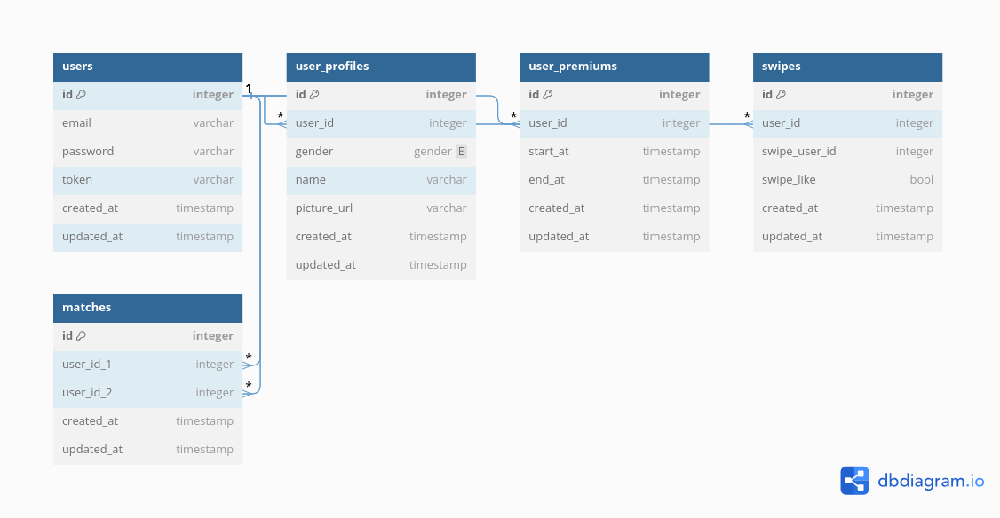
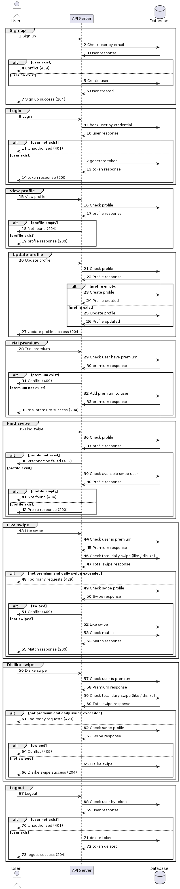

# Document

1. GitHub Repository URL: [https://github.com/redzjovi/dealls-dating-backend](GitHub)

2. Functional & Non-Functional Requirements:

    Functional Requirements:

    - Sign up, login, logout
    - View, update profile
    - Swipe (find / like / dislike) with a daily limit (10) to get match
    - List, trial premium feature for unlimited swipe

    Non-Functional Requirements:

    - Scalability
    - Security (password hashing, authentication token)
    - Performance (efficient queries)

3. Tech Stack:

    - Docker Compose: Simplifies containerization and environment setup
    - PostgreSQL: Reliable and robust relational database
    - Golang: Efficient, high-performance language suitable for backend services
    - Gorm: Simplifies database operations with Go

4. System Design:

    ERD Diagram:

    

    Sequence Diagram:

    

5. Test Cases:

    Authentication Sign Up

    - Missing required field (Bad Request)
    - Duplicate sign up email (Conflict)
    - Valid sign up (No Content)

    Authentication Login

    - Invalid login (Unauthorized)
    - Invalid credential (Unauthorized)
    - Valid login (Ok)

    Authentication Logout

    - Invalid credential (Unauthorized)
    - Valid logout (No Content)

    Profile View

    - Missing profile (Not Found)
    - View profile (Ok)

    Profile Update

    - Missing required field (Bad Request)
    - Valid update (No Content)

    Swipe View

    - Missing profile (Precondition Failed)
    - No swipe data (Not Found)
    - View swipe (Ok)

    Swipe Like

    - Exceed daily like (Too Many Requests)
    - Like within premium and unlimited (Ok)
    - Duplicate like (Conflict)
    - Valid like (Ok)

    Swipe Dislike

    - Exceed daily dislike (Too Many Requests)
    - Dislike within premium and unlimited (Ok)
    - Duplicate dislike (Conflict)
    - Valid dislike (Ok)

    Premium View
    - Valid premium (Ok)

    Premium Trial
    - Duplicate trial (Conflict)
    - Valid trial (No Content)
